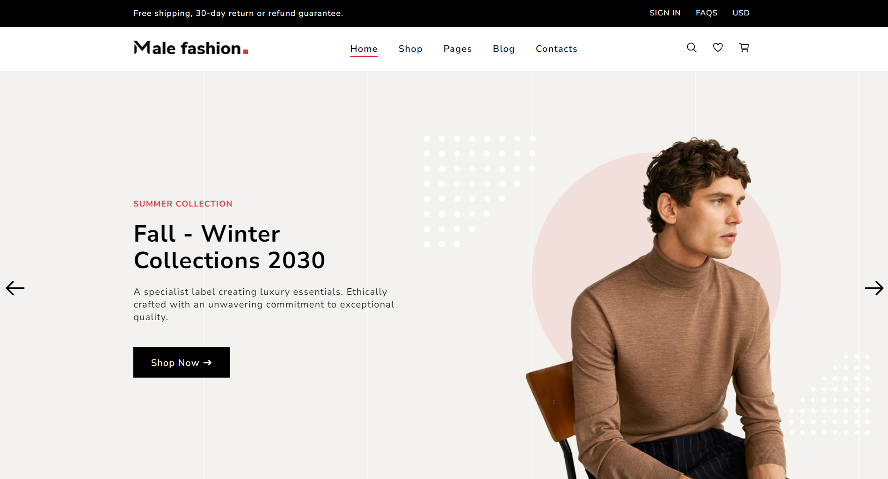

<!-- PROJECT INTRO -->

  

  <h1> Ecommerce AB </h1>

  <h3> This is a Complete Ecommerce Website </h3>
  

    <a href="https://abdullahab120.github.io/Complete-Ecommerce-website/"> View Demo </a>
    ·
    <a href="https://github.com/AbdullahAB120/Complete-Ecommerce-website//issues/new?labels=bug&template=bug-report---.md"> Report Bug </a>
    ·
    <a href="https://github.com/AbdullahAB120/Complete-Ecommerce-website//issues/new?labels=enhancement&template=feature-request---.md"> Request Feature </a>
  

 
 

<!-- ABOUT THE PROJECT -->
## About The Project

A modern and fully featured front-end e-commerce website built using HTML5, CSS3, and Vanilla JavaScript. This project was developed to strengthen my front-end development skills by recreating the core functionality and user experience of a real-world online shopping platform.
The website includes multiple pages, interactive UI components, and dynamic front-end features commonly found in professional e-commerce websites. Every section was designed with a clean, minimal, and user-friendly interface while maintaining a consistent design system throughout the project.
Although this project does not include a backend or database integration, it focuses on implementing complete front-end functionality using only HTML, CSS, and JavaScript.

### Features:
- Built with HTML5, CSS3 & Vanilla JavaScript
- Modern & Professional E-commerce UI
- Responsive Navigation Bar
- Hero Banner & Promotional Sections
- Product Listing Page
- Advanced Product Filtering Interface
- Product Search Interface
- Product Details Page
- Image Gallery with Thumbnail Preview
- Product Reviews & Rating Section
- Additional Product Information
- Shopping Cart Interface
- Wishlist Functionality
- Quantity Selector
- Login & Registration Pages
- Password Show/Hide Toggle
- FAQ Section
- Contact Page
- Newsletter Subscription Section
- Customer Reviews
- Related Products
- Smooth Hover Effects & Animations
- Clean & Well-Structured Code
- Organized Folder Structure
- Desktop-Optimized Design

This project significantly improved my understanding of front-end web development by allowing me to build a complete e-commerce interface from scratch. Throughout the development process, I practiced semantic HTML, advanced CSS layouts, Flexbox, Grid, JavaScript DOM manipulation, event handling, reusable UI components, and interactive user experiences.
Working on this project also helped me develop better code organization skills and gain practical experience in designing large-scale front-end applications while maintaining a clean and consistent user interface.

 
 

<!-- BUILT WITH -->
## Built With

 
 
 
 
 
 

 
 
<!-- CONTRIBUTING -->
## Contributing

Contributions are what make the open source community such an amazing place to learn, inspire, and create. Any contributions you make are **greatly appreciated**.

If you have a suggestion that would make this better, please fork the repo and create a pull request. You can also simply open an issue with the tag "enhancement".
Don't forget to give the project a star! Thanks again!

1. Fork the Project
2. Create your Feature Branch (`git checkout -b feature/AmazingFeature`)
3. Commit your Changes (`git commit -m 'Add some AmazingFeature'`)
4. Push to the Branch (`git push origin feature/AmazingFeature`)
5. Open a Pull Request

 
 

<!-- LICENSE -->
## License

Distributed under the MIT License. See `LICENSE.txt` for more information.

 
 

<!-- CONTACT -->
## Contact 

<a href="https://www.facebook.com/AbdullahAB120"> Facebook </a>
·
<a href="https://www.instagram.com/AbdullahAB_120"> Instagram </a>
·
<a href="https://www.linkedin.com/in/AbdullahAB120"> LinkedIn </a>
·
<a href="https://www.x.com/AbdullahAB120"> Twitter </a>
·
<a href="https://www.fiver.com/AbdullahAB120"> Fiverr </a>
